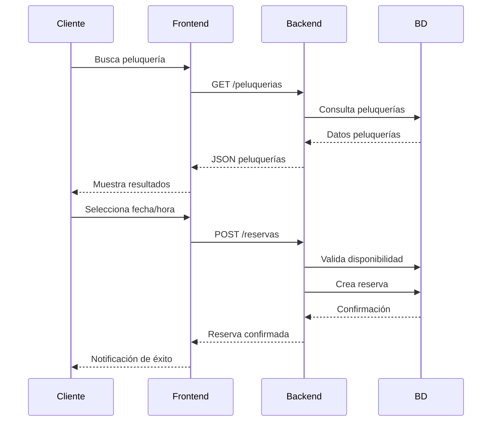

# Pelucap 💇

**Sistema de reserva de turnos para peluquerías**

Una plataforma integral que conecta peluquerías con clientes, facilitando la reserva de turnos en línea con gestión de precios y disponibilidad.

---

## 📋 Descripción

Pelucap es una aplicación web que permite:

- **Peluquerías** registrarse como proveedores, gestionar su catálogo de servicios y definir precios
- **Clientes** buscar peluquerías disponibles, reservar turnos y gestionar sus citas
- Transacciones seguras y trazabilidad de reservas

---

## 🏗️ Stack Tecnológico

| Componente | Tecnología |
|-----------|-----------|
| **Backend** | Django (Python) |
| **Frontend** | React (JavaScript/TypeScript) |
| **Base de Datos** | PostgreSQL (recomendado) |
| **API** | REST API |

---

## 🎯 Características Principales

### Para Peluquerías (Proveedores)
- ✅ Registro y autenticación
- ✅ Gestión de horarios y disponibilidad
- ✅ Definición de servicios y precios
- ✅ Panel de control de reservas
- ✅ Historial de citas completadas

### Para Clientes
- ✅ Registro y autenticación
- ✅ Búsqueda de peluquerías
- ✅ Visualización de servicios y precios
- ✅ Reserva de turnos en línea
- ✅ Gestión de mis reservas
- ✅ Historial de servicios

---

## 📊 Diagrama de Casos de Uso

```mermaid
graph TB
    subgraph Actores
        Cliente["👤 Cliente"]
        Peluqueria["💇 Peluquería"]
        Admin["⚙️ Administrador"]
    end

    subgraph "Casos de Uso - Cliente"
        CU1["Registrarse"]
        CU2["Iniciar Sesión"]
        CU3["Buscar Peluquerías"]
        CU4["Ver Servicios"]
        CU5["Reservar Turno"]
        CU6["Cancelar Reserva"]
        CU7["Ver Mis Reservas"]
        CU8["Calificar Servicio"]
    end

    subgraph "Casos de Uso - Peluquería"
        CU9["Registrarse"]
        CU10["Iniciar Sesión"]
        CU11["Gestionar Servicios"]
        CU12["Definir Precios"]
        CU13["Gestionar Horarios"]
        CU14["Ver Reservas"]
        CU15["Confirmar Reserva"]
        CU16["Cancelar Reserva"]
    end

    subgraph "Casos de Uso - Sistema"
        CU17["Procesar Pago"]
        CU18["Enviar Notificaciones"]
        CU19["Generar Reportes"]
    end

    Cliente --> CU1
    Cliente --> CU2
    Cliente --> CU3
    Cliente --> CU4
    Cliente --> CU5
    Cliente --> CU6
    Cliente --> CU7
    Cliente --> CU8

    Peluqueria --> CU9
    Peluqueria --> CU10
    Peluqueria --> CU11
    Peluqueria --> CU12
    Peluqueria --> CU13
    Peluqueria --> CU14
    Peluqueria --> CU15
    Peluqueria --> CU16

    CU5 --> CU17
    CU15 --> CU17
    CU5 --> CU18
    CU15 --> CU18

    Admin --> CU19

    style Cliente fill:#e1f5ff
    style Peluqueria fill:#fff3e0
    style Admin fill:#f3e5f5
```



---

## 🔄 Flujo Principal de Reserva



---

## 📁 Estructura del Proyecto

```
pelucap/
├── backend/
│   ├── apps/
│   │   ├── usuarios/          # Autenticación y perfiles
│   │   ├── peluquerias/       # Gestión de peluquerías
│   │   ├── servicios/         # Servicios y precios
│   │   ├── reservas/          # Lógica de reservas
│   │   └── pagos/             # Procesamiento de pagos
│   ├── config/                # Configuración Django
│   └── manage.py
│
├── frontend/
│   ├── src/
│   │   ├── components/        # Componentes React
│   │   ├── pages/            # Páginas
│   │   ├── services/         # Llamadas API
│   │   └── hooks/            # Custom hooks
│   └── package.json
│
└── README.md
```

---

## 🚀 Instalación y Configuración

### Backend (Django)

```bash
# Clonar repositorio
git clone https://github.com/usuario/pelucap.git
cd pelucap/backend

# Crear entorno virtual
python -m venv venv
source venv/bin/activate  # En Windows: venv\Scripts\activate

# Instalar dependencias
pip install -r requirements.txt

# Ejecutar migraciones
python manage.py migrate

# Crear superusuario
python manage.py createsuperuser

# Iniciar servidor
python manage.py runserver
```

### Frontend (React)

```bash
cd ../frontend

# Instalar dependencias
npm install

# Iniciar servidor de desarrollo
npm start
```

---

## 🔐 Modelo de Datos (Relaciones)

```
Cliente
  ├── id (PK)
  ├── nombre
  ├── email (UNIQUE)
  ├── telefono
  ├── contraseña
  ├── fecha_registro
  └── reservas (FK → Reserva)

Peluqueria
  ├── id (PK)
  ├── nombre
  ├── email (UNIQUE)
  ├── telefono
  ├── dirección
  ├── ciudad
  ├── horario_apertura
  ├── horario_cierre
  ├── servicios (FK → Servicio)
  └── reservas (FK → Reserva)

Servicio
  ├── id (PK)
  ├── peluqueria_id (FK → Peluqueria)
  ├── nombre
  ├── descripción
  ├── precio
  ├── duración (minutos)
  └── activo

Reserva
  ├── id (PK)
  ├── cliente_id (FK → Cliente)
  ├── peluqueria_id (FK → Peluqueria)
  ├── servicio_id (FK → Servicio)
  ├── fecha
  ├── hora
  ├── estado (pendiente, confirmada, cancelada, completada)
  ├── monto_pago
  ├── fecha_creación
  └── comentarios (opcional)

Pago
  ├── id (PK)
  ├── reserva_id (FK → Reserva)
  ├── monto
  ├── método_pago
  ├── estado (pendiente, completado, fallido)
  └── fecha_transacción
```

---

## 🛠️ Desarrollo

### Requisitos Previos
- Python 3.8+
- Node.js 14+
- Git

### Contribuir
1. Fork el proyecto
2. Crea una rama para tu feature (`git checkout -b feature/AmazingFeature`)
3. Commit tus cambios (`git commit -m 'Add some AmazingFeature'`)
4. Push a la rama (`git push origin feature/AmazingFeature`)
5. Abre un Pull Request

---

## 📞 Contacto y Soporte

Para reportar bugs o sugerencias, por favor abre un issue en el repositorio.

---

## 📄 Licencia

Este proyecto está bajo la Licencia MIT. Consulta el archivo `LICENSE` para más detalles.

---

**¡Gracias por usar Pelucap!** 🎉
